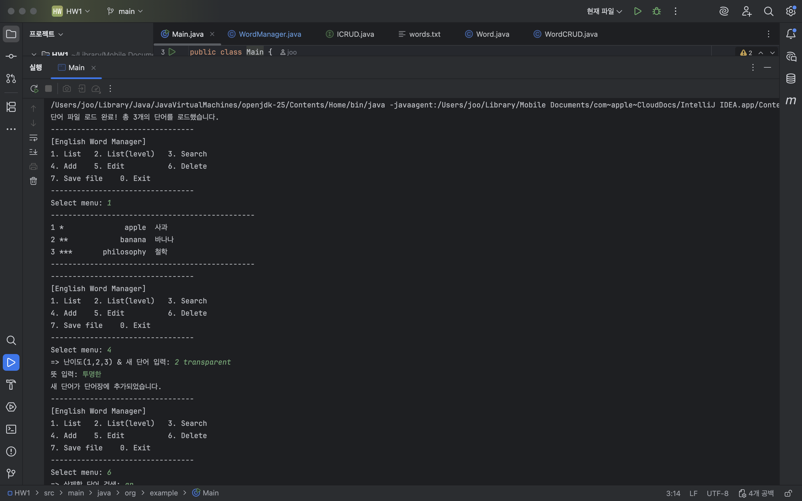
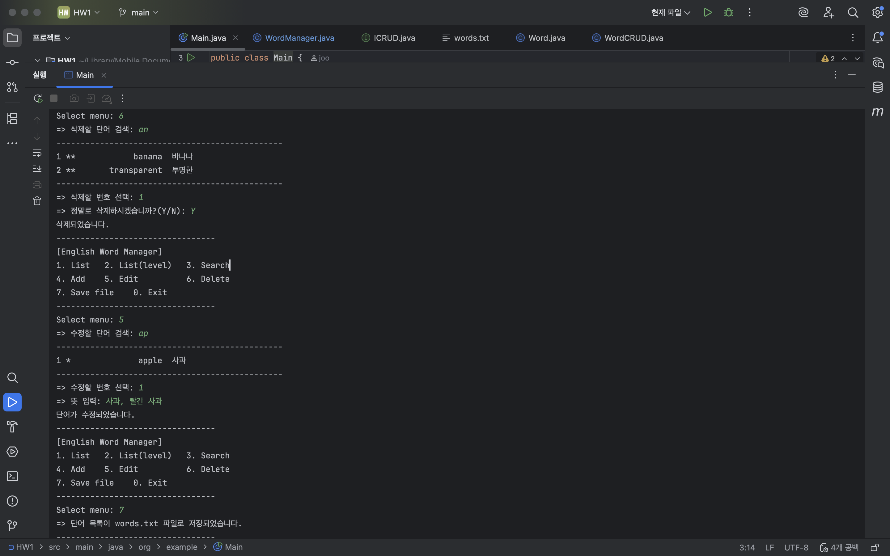
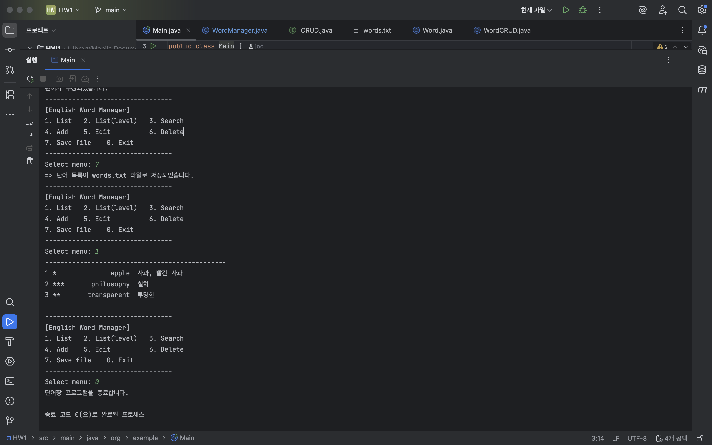

# 📚 영어 단어 관리기 (English Word Manager)

## 1. 프로젝트 개요

### 1.1. 프로젝트명
영어 단어 관리기 (English Word Manager)

### 1.2. 개발 목적
Java 기반 콘솔 애플리케이션을 통해 CRUD, 파일 입출력, 데이터 저장 및 검색 기능 구현 능력을 기른다.

---

## 2. 주요 기능 및 실행 방법

### 2.1. 주요 기능 목록

본 프로그램은 다음의 핵심 기능을 제공합니다.

| 기능 | 설명 |
| :--- | :--- |
| **List (메뉴 1)** | 저장된 모든 단어를 출력합니다. |
| **List(level) (메뉴 2)** | 지정한 난이도(1~3)의 단어만 출력합니다. |
| **Search (메뉴 3)** | 입력한 문자열이 포함된 단어를 검색합니다. |
| **Add (메뉴 4)** | 새로운 단어(난이도, 단어, 뜻)를 추가합니다. |
| **Modify (메뉴 5)** | 특정 단어를 검색하여 뜻을 수정합니다. |
| **Delete (메뉴 6)** | 특정 단어를 검색하여 삭제합니다. |
| **Save/Load (메뉴 7)** | 단어 목록을 'words.txt' 파일로 저장하고 불러옵니다. |

### 2.2. 예

